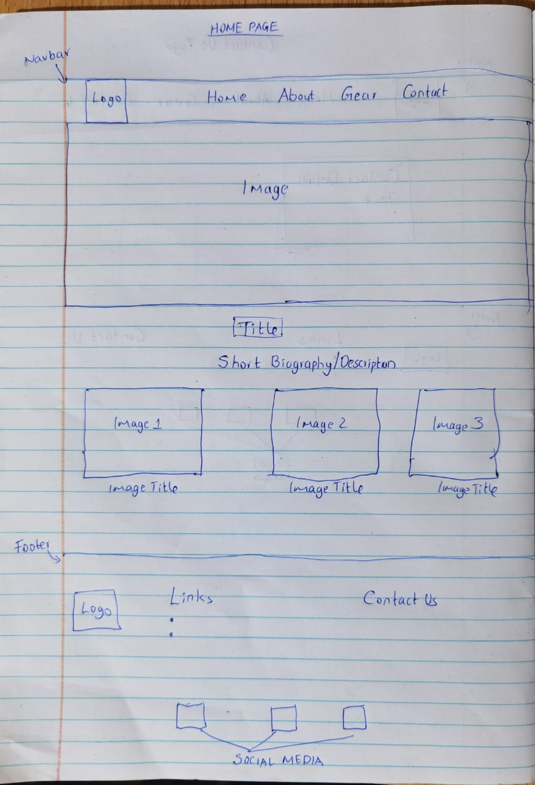
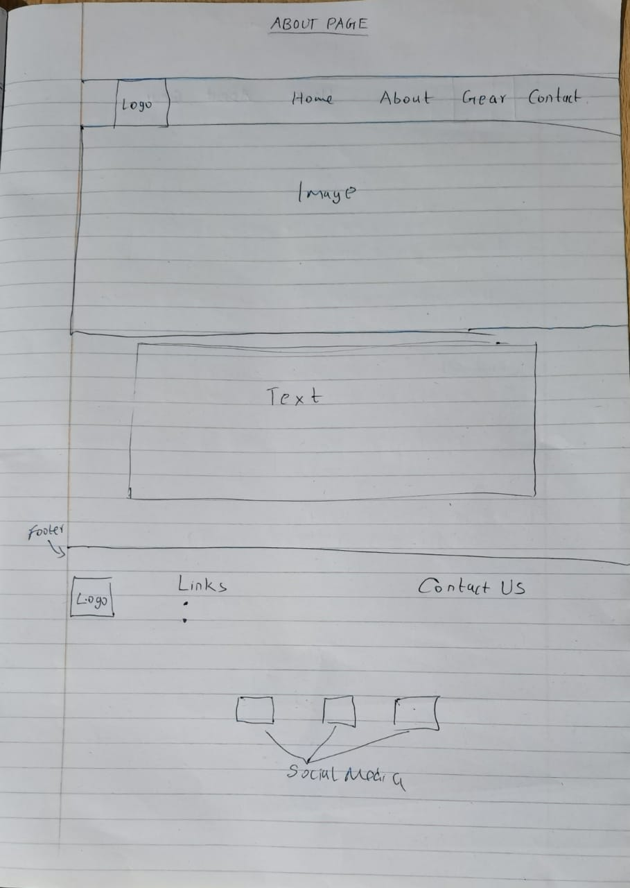
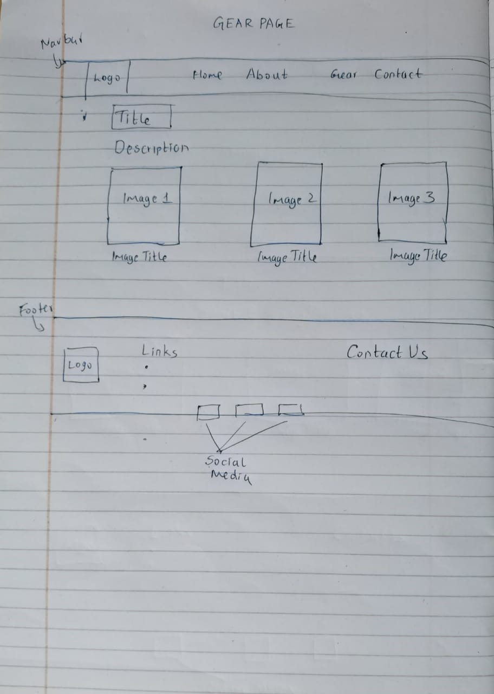
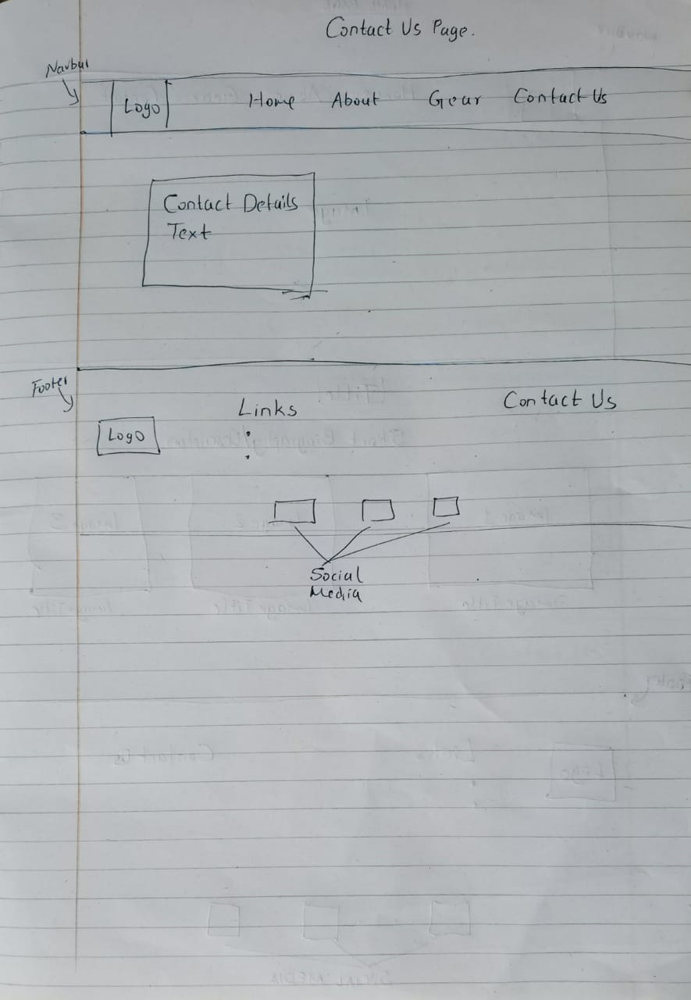

## Photography Website

This is a site to display photos, Date: 18/07/2021

By Khajira Christopher

## Description

The purpose of the photography website is to display favorite photos. The site contains four pages; the home page, about us page, gear we use page and the contact us page.
The home page has the navigation bar with a logo and the links to the other three pages. The home page has a short biography about the website. Below the short biography, the images
are displayed, three per row. After the display of the images, the website has a footer which contains a clickable logo, links and the contact us information.

The about us page contains the navigation bar and the footer just like the home page. Between these two elements, it contains an image and below it a description.

The "gear we use" page contains the navigation bar and the footer just like the home page. Between these two elements, it contains three images and below them their descriptions

The contact page contains the navigation bar and the footer just like the home page. Between these two elements, it contains the contact information as text6

## Setup/Installation Requirements
1. Clone the project using git -clone . If you are not able to clone it, you can download the files as a zip folder

2. Ensure that you have the complete file

3. Navigate to the index.html file which is in the root file of the folder. The application is static and only uses HTML and CSS 

4. Copy the path of the index.html file to your browser and you will be able to access the application.

## Technologies Used
This project uses HTML and CSS.
## Support and contact details
If you have any issues or questions, you can get intouch with me through email: christopher.khajira@student.moringaschool.com. Please feel free to make any contributions to the code.

## Design Diagrams
Landing Page

About Page

Gear Page

Contact Page

### License
MIT License
Copyright (c) 2021 Khajira Christopher